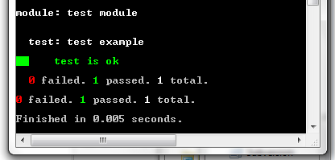

QUnit-run
=========

Run your QUnit tests "out-of-browser" using node.js.

Create a file test like this example:

```javascript
module('test module');

test('test example', function(){
	ok(true, 'test is ok');
});
```

...and have this output:


